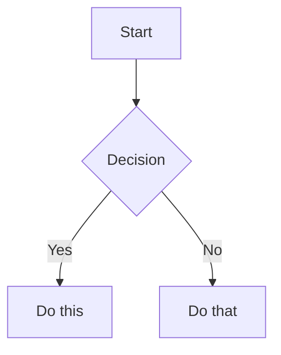

# Obsidian Skill

Comprehensive skill for Obsidian: Markdown authoring, Bases (database views), and CLI operations.

---

## Part 1: Obsidian Flavored Markdown

Create and edit valid Obsidian Flavored Markdown. Obsidian extends CommonMark and GFM with wikilinks, embeds, callouts, properties, comments, and other syntax. This covers only Obsidian-specific extensions — standard Markdown is assumed knowledge.

### Workflow: Creating an Obsidian Note

1. **Add frontmatter** with properties (title, tags, aliases) at the top of the file. See [PROPERTIES.md](references/PROPERTIES.md) for all property types.
2. **Write content** using standard Markdown for structure, plus Obsidian-specific syntax below.
3. **Link related notes** using wikilinks (`[[Note]]`) for internal vault connections, or standard Markdown links for external URLs.
4. **Embed content** from other notes, images, or PDFs using the `![[embed]]` syntax. See [EMBEDS.md](references/EMBEDS.md) for all embed types.
5. **Add callouts** for highlighted information using `> [!type]` syntax. See [CALLOUTS.md](references/CALLOUTS.md) for all callout types.
6. **Verify** the note renders correctly in Obsidian's reading view.

> When choosing between wikilinks and Markdown links: use `[[wikilinks]]` for notes within the vault (Obsidian tracks renames automatically) and `[text](url)` for external URLs only.

### Internal Links (Wikilinks)

```markdown
[[Note Name]]                          Link to note
[[Note Name|Display Text]]             Custom display text
[[Note Name#Heading]]                  Link to heading
[[Note Name#^block-id]]                Link to block
[[#Heading in same note]]              Same-note heading link
```

Define a block ID by appending `^block-id` to any paragraph:

```markdown
This paragraph can be linked to. ^my-block-id
```

### Embeds

Prefix any wikilink with `!` to embed its content inline:

```markdown
![[Note Name]]                         Embed full note
![[Note Name#Heading]]                 Embed section
![[image.png]]                         Embed image
![[image.png|300]]                     Embed image with width
![[document.pdf#page=3]]               Embed PDF page
```

See [EMBEDS.md](references/EMBEDS.md) for audio, video, search embeds, and external images.

### Callouts

```markdown
> [!note]
> Basic callout.

> [!warning] Custom Title
> Callout with a custom title.

> [!faq]- Collapsed by default
> Foldable callout (- collapsed, + expanded).
```

Common types: `note`, `tip`, `warning`, `info`, `example`, `quote`, `bug`, `danger`, `success`, `failure`, `question`, `abstract`, `todo`.

See [CALLOUTS.md](references/CALLOUTS.md) for the full list with aliases, nesting, and custom CSS callouts.

### Properties (Frontmatter)

```yaml
---
title: My Note
date: 2024-01-15
tags:
  - project
  - active
aliases:
  - Alternative Name
cssclasses:
  - custom-class
---
```

See [PROPERTIES.md](references/PROPERTIES.md) for all property types, tag syntax rules, and advanced usage.

### Tags

```markdown
#tag                    Inline tag
#nested/tag             Nested tag with hierarchy
```

Tags can contain letters, numbers (not first character), underscores, hyphens, and forward slashes.

### Comments

```markdown
This is visible %%but this is hidden%% text.

%%
This entire block is hidden in reading view.
%%
```

### Obsidian-Specific Formatting

```markdown
==Highlighted text==                   Highlight syntax
```

### Math (LaTeX)

```markdown
Inline: $e^{i\pi} + 1 = 0$

Block:
$$
\frac{a}{b} = c
$$
```

### Diagrams (Mermaid)

````markdown

````

### Footnotes

```markdown
Text with a footnote[^1].

[^1]: Footnote content.

Inline footnote.^[This is inline.]
```

---

## Part 2: Obsidian Bases

Create and edit `.base` files — database-like views of vault notes with filters, formulas, and multiple view types.

### Workflow

1. **Create the file**: Create a `.base` file in the vault with valid YAML content
2. **Define scope**: Add `filters` to select which notes appear (by tag, folder, property, or date)
3. **Add formulas** (optional): Define computed properties in the `formulas` section
4. **Configure views**: Add one or more views (`table`, `cards`, `list`, or `map`) with `order` specifying which properties to display
5. **Validate**: Verify the file is valid YAML with no syntax errors

### Schema

```yaml
filters:
  and: []    # All conditions must match
  or: []     # Any condition matches
  not: []    # Exclude matches

formulas:
  formula_name: 'expression'

properties:
  property_name:
    displayName: "Display Name"

summaries:
  custom_summary_name: 'values.mean().round(3)'

views:
  - type: table | cards | list | map
    name: "View Name"
    limit: 10
    groupBy:
      property: property_name
      direction: ASC | DESC
    filters:
      and: []
    order:
      - file.name
      - property_name
      - formula.formula_name
    summaries:
      property_name: Average
```

### Filter Syntax

```yaml
# Single filter
filters: 'status == "done"'

# AND/OR/NOT
filters:
  and:
    - 'status == "done"'
    - 'priority > 3'
```

Operators: `==`, `!=`, `>`, `<`, `>=`, `<=`, `&&`, `||`, `!`

### File Properties

| Property | Type | Description |
|----------|------|-------------|
| `file.name` | String | File name |
| `file.path` | String | Full path |
| `file.folder` | String | Parent folder |
| `file.ctime` | Date | Created time |
| `file.mtime` | Date | Modified time |
| `file.tags` | List | All tags |
| `file.links` | List | Internal links |
| `file.backlinks` | List | Files linking to this |
| `file.size` | Number | File size in bytes |

### Formula Syntax

```yaml
formulas:
  total: "price * quantity"
  status_icon: 'if(done, "✅", "⏳")'
  days_old: '(now() - file.ctime).days'
  days_until_due: 'if(due_date, (date(due_date) - today()).days, "")'
```

**Key functions:** `date()`, `now()`, `today()`, `if()`, `duration()`, `file()`, `link()`

**Duration:** Subtracting dates returns Duration — access `.days`, `.hours`, etc. before using number functions.

### Default Summaries

`Average`, `Min`, `Max`, `Sum`, `Range`, `Median`, `Stddev`, `Earliest`, `Latest`, `Checked`, `Unchecked`, `Empty`, `Filled`, `Unique`

### Complete Example

```yaml
filters:
  and:
    - file.hasTag("task")
    - 'file.ext == "md"'

formulas:
  days_until_due: 'if(due, (date(due) - today()).days, "")'
  priority_label: 'if(priority == 1, "🔴 High", if(priority == 2, "🟡 Medium", "🟢 Low"))'

views:
  - type: table
    name: "Active Tasks"
    filters:
      and:
        - 'status != "done"'
    order:
      - file.name
      - status
      - formula.priority_label
      - due
      - formula.days_until_due
    groupBy:
      property: status
      direction: ASC
```

### Embedding Bases

```markdown
![[MyBase.base]]
![[MyBase.base#View Name]]
```

### YAML Quoting Rules

- Single quotes for formulas containing double quotes: `'if(done, "Yes", "No")'`
- Double quotes for simple strings: `"My View Name"`

### Troubleshooting

- **Duration math:** Always access `.days`/`.hours` before `.round()` — Duration is not a number
- **Null checks:** Use `if()` to guard properties that may not exist
- **Undefined formulas:** Every `formula.X` in `order` must have matching entry in `formulas`

See [FUNCTIONS_REFERENCE.md](references/FUNCTIONS_REFERENCE.md) for the complete reference of all types.

---

## Part 3: Obsidian CLI

Use the `obsidian` CLI to interact with a running Obsidian instance. Requires Obsidian to be open.

### Command Reference

Run `obsidian help` to see all available commands. Full docs: https://help.obsidian.md/cli

### Syntax

**Parameters** take a value with `=`. Quote values with spaces:

```bash
obsidian create name="My Note" content="Hello world"
```

**Flags** are boolean switches with no value:

```bash
obsidian create name="My Note" silent overwrite
```

### File Targeting

- `file=<name>` — resolves like a wikilink (name only, no path or extension needed)
- `path=<path>` — exact path from vault root

Without either, the active file is used.

### Vault Targeting

Use `vault=<name>` as the first parameter to target a specific vault:

```bash
obsidian vault="My Vault" search query="test"
```

### Common Patterns

```bash
obsidian read file="My Note"
obsidian create name="New Note" content="# Hello" template="Template" silent
obsidian append file="My Note" content="New line"
obsidian search query="search term" limit=10
obsidian daily:read
obsidian daily:append content="- [ ] New task"
obsidian property:set name="status" value="done" file="My Note"
obsidian tasks daily todo
obsidian tags sort=count counts
obsidian backlinks file="My Note"
```

Use `--copy` to copy output to clipboard. Use `silent` to prevent files from opening. Use `total` on list commands to get a count.

### Plugin Development

After making code changes to a plugin or theme:

1. **Reload**: `obsidian plugin:reload id=my-plugin`
2. **Check errors**: `obsidian dev:errors`
3. **Verify visually**: `obsidian dev:screenshot path=screenshot.png`
4. **Check console**: `obsidian dev:console level=error`

Additional: `obsidian eval code="..."`, `obsidian dev:css selector="..." prop=background-color`, `obsidian dev:mobile on`

---

## References

- [Obsidian Flavored Markdown](https://help.obsidian.md/obsidian-flavored-markdown)
- [Bases Syntax](https://help.obsidian.md/bases/syntax)
- [CLI Docs](https://help.obsidian.md/cli)
- [Properties Reference](references/PROPERTIES.md)
- [Embeds Reference](references/EMBEDS.md)
- [Callouts Reference](references/CALLOUTS.md)
- [Functions Reference](references/FUNCTIONS_REFERENCE.md)
